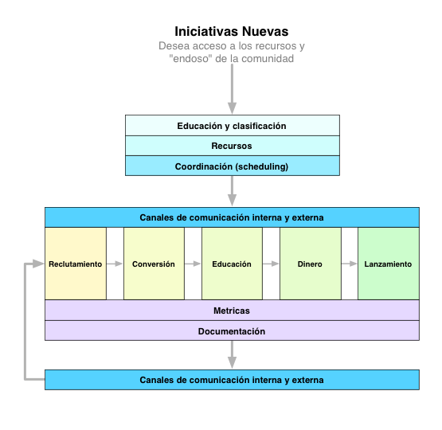

# SoPR Founding Documents Project

Version 0.0.1

Hace unos años empezamos a organizar eventos bajo el nombre **Startups of Puerto Rico** (SoPR). En ese momento la intención era tener un nombre que sonara oficial para poder darle forma a la comunicación pública de estos eventos. Creamos un website para comunicar lo que intentábamos hacer y para que las personas que se identificaran con nuestra comunidad se unieran y participaran de los eventos.

Eso fue hace unos años y ahora llegó el momento del siguiente paso. En los últimos meses este tema de los startups ha tomado mucha prominencia y cada día vemos una iniciativa nueva para promover startups y hackers lo que nos parece fenomenal. El problema es que esas *iniciativas individuales* no son suficiente para lograr un impacto grande en el país.

### ¿Que queremos hacer?
Queremos darle un poco de forma a SoPR. Lo que queremos es que como comunidad generemos una serie de documentos y acuerdos (en un proyecto open source como este) en los que se estipule como queremos colaborar y como vamos a lograr nuestro cometido de producir startups de tecnología en Puerto Rico.

#### Principios
- No vamos pedir permiso para lograr un cambio. Vamos a "hackiar" la economía del país.
- Este esfuerzo es de la comunidad y no de un individuo o compañía.
- Queremos crear procesos y esfuerzos que sean abiertos y transparentes en el mejor espíritu de la comunidad open source y free software.
- El gobierno
	- Es un visitante y no un residente de esta comunidad.
 	- Este esfuerzo no depende ni dependerá de ayuda gubernamental, fondos ni legislación alguna.
	- Esto no es un esfuerzo de partido o administración alguna
	- Nadie de ningún partido o administración tiene inherencia en la comunidad de forma oficial. Queda claro que hay personas en la comunidad que participan de la política y el gobierno y son bienvenidos pero su rol es el mismo que el de cualquier otro componente de la comunidad.
	- Si algún partido o administración decide apoyar a la comunidad será bajo estrictas reglas que impondrá la comunidad y tendría un rol y protagonismo muy limitado.
	- El envolvimiento de algún partido o administración siempre lleva consigo el riesgo de que nuestro esfuerzo genuino de comunidad se convierta en balón político o que estigmaticen a nuestro grupo como penepés, populares, pipiolos, pelús, turbas, etc. No lo vamos a permitir.
- Algo más…?

#### Una estrategia

Lo primero es entender que para poder lograr lo que queremos es necesario ver un panorama amplio y no solo enfocarnos en pequeñas iniciativas. Para esto algunos miembros de la comunidad hemos desarrollado la primera versión del mapa de SoPR. Esto es un diagrama que muestra las 5 etapas en el proceso que va desde una persona interesada en temas de startups hasta esta misma persona lazar su propio startup.

Lo bueno de nuestra comunidad es que ya hay personas que desinteresadamente están manejando con mucho éxito, algunas iniciativas en cada una de esas etapas. Necesitamos más iniciativas y necesitamos que las que ya existen optimicen para mover a las personas a la próxima etapa.

Aquí están las etapas con algunos ejemplos de iniciativas existentes y algunas que nos hacen falta:

- **Reclutamiento**: Este es el tipo de evento perfecto para cualquier persona que está mínimamente interesada en la comunidad de startups o tecnología.
	- Startup After Hours
	- prPIG
	- Init6
- **Conversión**: Estos eventos requieren un poco más conocimiento pero el punto es que se prestan para que la persona se pueda ver a si mismo como un "doer" y haga el cambio mental necesario para luego decidirse a empezar un startup.
	- Startup Weekend
	- Hackathons
- **Educación**: Programas para añadir conocimiento y prepara a los candidatos de forma un poco más formal para poder ejecutar sobre la idea de empezar un startup.
	- Founders Institute
 	- prPIG
	- Init6
	- Hardware Hackers
- **Dinero**: Recursos para levantar capital.
	- Angel Forum
	- Accelerators
- **Lanzamiento**: Recursos para lograr lanzar el producto y para ayudar en el crecimiento.
	- Professional Directory
	- Office Hours
	- Community Advisory Board

#### Tácticas
Tenemos que enfocarnos para poder potenciar el impacto de cada iniciativa. No podemos seguir compitiendo por el spotlight. Si nos organizamos podemos poner todo el peso de la comunidad detrás de cada esfuerzo.

Lo que se me ocurre para bregar con esto es generar un proceso para someter propuestas de eventos y programas que hacen falta en la comunidad. Este proceso debe ser abierto y transparente. De nuevo usemos el modelo open source.

Un ejemplo. Digamos que alguien que no conocido en la comunidad quiere hacer un evento tipo Barcamp o Hackathon. Esta persona puede contactar a SoPR de una forma ya estipulada y documentada (piensen en algo como los PEP de Python pero mucho más simple). Deben haber unos requisitos mínimos que por ejemplo pueden ser tener un equipo de trabajo de N número de personas para trabajar ese tipo de evento.

Si la persona cumple con los requisitos (los que se decidan) esa persona recibe acceso a los recursos de la comunidad que pueden ser: contactos en la prensa, enviar notificaciones a una lista de emails de toda la comunidad, acceso a locales para celebrar eventos que ya se tienen previamente acordados, contactos de auspiciadores, ayuda organizando el evento, proyectores, modems y cualquier otros recurso se tenga. Además el evento contará con el endoso de la comunidad de SoPR lo que debe ayudar a facilitar el asunto.

### ¿Para que vamos a hacer esto?
Nuestra intención con SoPR es crear por lo menos 50 startups en los próximos 5 años, cada uno con un ingreso de 2 millones de dólares al año. Esto significa un crecimiento de 100 millones de dólares al año y por lo menos 100 empleos buenos. Claro demás está decir que esto también nos pone en carrera para que uno de esos 50 startups tenga una "salida" lo que significaría mucho más dinero en la economía.

### ¿Qué documentos, acuerdos y herramientas necesitamos?
- Hay que crear un documento que describa la composición y elección de un **core team**. Inicialmente pienso que ese equipo debe estar compuesto por miembros activos y reconocidos de la comunidad y estoy seguro que no debe tener muchos miembros para facilitar la toma de decisiones.
- Hay que crear un documento que describa como someter **propuestas para iniciativas individuales** a ser evaluadas, aceptadas y promovidas por SoPR. El proceso tiene que ser 100% transparente y debe permitir y fomentar la diversidad de todo tipo.
- Hay que crear un documento que describa un proceso para reemplazar cualquiera de estos documentos y un **proceso de votación o deliberación** para cambiar cualquier regla o decisión que la comunidad haya tomado.
- Necesitamos definir un sistema para agregar y compartir data de nuestro progreso. Hay que definir cuales son las **métricas principales**.
- Necesitamos un **mailing list** de toda la comunidad. Esta será nuestra herramienta principal de comunicación interna para asuntos generales y anuncios.
- Necesitamos **rehacer el website** de startupsofpuertorico.com para tener toda esta información disponible e incluso proveer herramientas para automatizar los procesos y reglas que generaremos. Esto es un proyecto perfecto para el próximo hackathon.
- Necesitamos un **calendario centralizado** de toda la comunidad para facilitara el tema de "scheduling" y tratar de evitar conflictos de fechas entre eventos similares.
- Necesitamos un **directorio/marketplace** de programadores, diseñadores, músicos, ilustradores y todo talento relacionado a startups de tecnología. Esto puede servir como punto de encuentro para que estos puedan conseguir "gigs" para generar dinero en lo que lanzan sus productos (bootstrapping).
- Necesitamos un **directorio de startups**.
- Necesitamos un directorio de recursos disponibles como por ejemplo: projectos open source abiertos por la comunidad, datasets relevantes para la comunidad y APIs proveídos por entidades gubernamentales y privadas en la isla.
- Necesitamos un lugar central donde hacer preguntas y obtener respuestas (e.g.: sopr.stackexchange.com) [issue](https://github.com/SoPR/FoundingDocuments/issues/3).

### ¿Cómo empezamos?
Debemos tener un plan concreto para cumplir con estas necesidades. Para comenzar, haremos lo siguiente:
1. Visita [la sección de "issues" de este repositorio, filtrado por el label de necesidades](https://github.com/SoPR/FoundingDocuments/issues?labels=necesidades&page=1&state=open). 
2. Si no hay un "issue" abierto con la necesidad que deseas ayudar a realizar, crea uno nuevo. Recuerda añadir el "label" de "necesidad". 
3. Vuelve a este documento y añade un enlace al "issue" a la necesidad correspondiente en la sección de _¿Qué documentos, acuerdos y herramientas necesitamos?_ de este documento. 
### Fork, hack y envia tu pull request
Creo que queda claro que hay mucho por hacer así que necesitamos tu ayuda. Esto es un proyecto open source y necesitamos tu ayuda. Puedes cambiar todo lo que creas que hay que cambiar y puedes someter tus sugerencias como issues. La idea es que terminemos con algo que sirva a los intereses de la comunidad y nos ayude a conseguir nuestras metas.